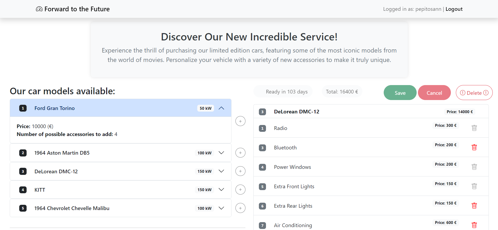

# Exam #2: "Car Configurator"
## Student: s329425 ARMENANTE PIETRO

## React Client Application Routes

- Route `/`: list of car models and accessories, accessible by anybody (both authenticated or not), and the car configuration creation and editing layout ONLY for authenticated users
- Route `/login`: login form. After successful login, it redirect to `/` modified with the possibility to create/see a car configuration
- Route `*`: not found page

## API Server

- GET `/api/models` : API to get all the models from the backend. It returns a JSON object with the list of models, or description of the error(s)
- GET `/api/accessories` : API to get all the accessories from the backend or get the number of available accessories for each accessory (based on the presence of the filter). It returns a JSON object with the list of accessories, or description of the error(s), or the value indicating the number of available accessories.
- POST `/api/car-configuration` : API to create a new car configuration for the currently logged in user. Only authenticated user can do that and return only the car condifiguration related to that user. The actual car configuration is passed to the server. Its returning value is empty on success, or a JSON object with error description.
- DELETE `/api/car-configuration` : API to delete the current car configuration for the currently logged in user. Only authenticated user can do that. Its returning value is empty on success, otherwise a JSON object with the error.
- POST `/api/car-configuration-modifications` : API to edit the existing car configuration for the currently logged in user. Only authenticated user can do that. The modifications to add and removed are passed to the server. Its returning value is empty on success, or a JSON object with error description.

### Authentication API

- POST `/api/session` : API to authenticate the user and create a session. Username and password are passed to the server. It returns a JSON object with the user's info and, if the user has a car configurataion, the CarConfiguration; or a description of the errors.
- DELETE `/api/session`: API to logs the user out
- GET `/api/session/current` : API to checks if the user is logged in and returns its information. It returns a JSON object with the same info as in login.
- GET `/api/auth-token` : API to provide an authentication token for the logged in user. it returns a JSON object with token.

## API Server2

- POST `/api/time` : API to post the manifacturing time for the car configuration. The currently savedCarConfiguration is passed to the server. It returns a JSON object with the manifacturing time.

## Database Tables

- Table `users` - contains id, username, hash of the pwd, salt, owner, quality - stores the user. Owner has been used to define if a user own a car configuration or not. Quality has been used to define if a user is a good client or not.
- Table `models` - contains id, name, power, price, max_number - stores the models
- Table `accessories` - contains id, name, description, price, availability, mandatory - stores the accessories
- Table `car_configurations` - contains user_id, models_id - stores the car configurations
- Table `selected_accessories` - contains user_id, acccessory_id - stores the selected accessories by the user for their car configuration
- Table `incompats` - contains accessory, incompat - stores the incompatible accessories, stores for each row the cuple of incompatible accessories (in both directions)

## Main React Components

- `Main` (in `App.js`) : technically a component, takes the role of App and is rendered inside a Router to be able to use the useNavigate hook. This maintains most of the state of the app.

- `ModelList` (in `ModelList.jsx`) : the list of all models.
- `ModelItem` (in `ModelList.jsx`) : a single model in the ModelList. The usage of an Accordion React componentn permits to see some core information about the model like the its code, name and the power. It can be expanded to see the model's price and the maximum number of accessories that can be added to that specific model. When in the car configuration editing session, this puts a small round button next to the accordion item to add/remove the model to/from the car configuration checking the possible constraints (like that fact that only one model can be selected per car configuration).
- `ModelItemDetails` (in `ModelList.jsx`) : the body of a ModelItem's accordion item.

- `AccessoryList` (in `AccessoryList.jsx`) : the list of all accessories.
- `AccessoryItem` (in `AccessoryList.jsx`) : a single accessory in the AccessoryList. The usage of an Accordion React component permits to see some core information about the accessory like the its code, name and the the number of available pieces. It can be expanded to see the accessory's constraints, the description and the price. When in the car configuration editing session, this puts a small round button next to the accordion item to add/remove the course to/from the car configuration checking the possible constraints. 
- `AccessoryItemDetails` (in `AccessoryList.jsx`) : the body of a AccessoryItem's accordion item.

- `CarConfiguration` (in `CarConfiguration.jsx`) : when a user is logged in, this renders their car configuration as a toolbar plus list of model and accessories (or just the toolbar if no car configuration has been created yet), and allows them to edit it.
- `CarConfigurationList` (in `CarConfiguration.jsx`) : the proper list of model and accessories in the car configuration.
- `AccessoriesListItem` (in `CarConfiguration.jsx`) : the proper list of model in the car configuration that defines the CarConfigurationList
- `ModelListItem` (in `CarConfiguration.jsx`) : the proper list of accessories in the car configuration that defines the CarConfigurationList

- `LoginForm` (in `LoginForm.jsx`) : the login form that user can use to login into the app. This is responsible for the client-side validation of the login credentials (valid username and non-empty password).

- `Toolbar` (in `CarConfiguration.jsx`) : shows important information on the current car configuration (like the total price and the manifacturing time) and the buttons that the user can use to save the changes, discard them, or delete the car configuration altogether.

- `checkCarConfigurationModified` (in `Miscellaneous.jsx`) : check weather the current car configuration contains changes with respect to the previous saved version.
- `checkCarConfigurationConstraints` (in `Miscellaneous.jsx`) : check the compatibility of the specified accessory with the provided car configuration, also taking into account the maximum number of selectable accessories per model

## Screenshot

## Users Credentials

| username | password  | client type |
|-------|----------|-------------|
| pepitosann | fiorentina | good client |
| luca | spugna | none |
| saimon | sicilia | none |
| cricod | pistola | good client |
| elidegiu | colosseo | none |
